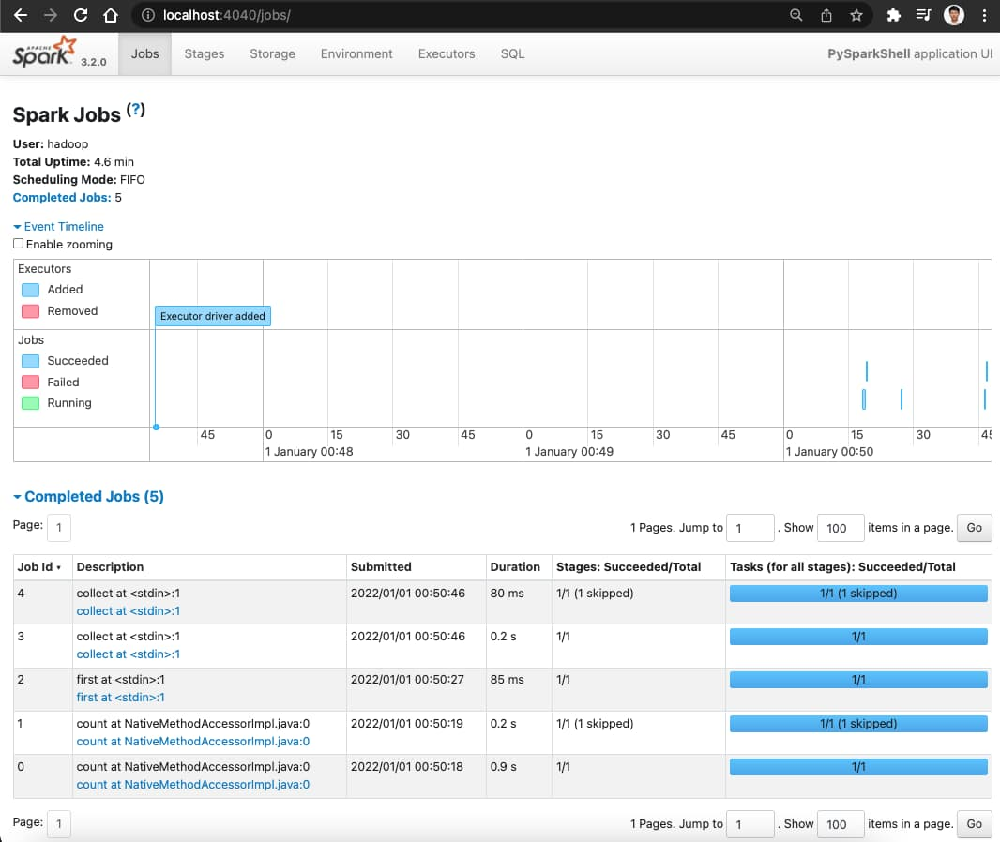

# Quick usage for spark-dev docker image
- Docker build and run
``` bash
git clone https://github.com/hibuz/ubuntu-docker
cd ubuntu-docker/hadoop/hive/spark

docker compose up
```

### Attach to running container
``` bash
docker exec -it spark bash
```

### Prepare input data
``` bash

cd $SPARK_HOME

# prepare input data
hdfs dfs -mkdir -p /user/hadoop
hdfs dfs -put README.md
```

### Interactive Analysis with the Spark Shell
``` bash

~/spark-3.2.0$ spark-shell

Spark context Web UI available at http://70dad71aa123:4040
Spark context available as 'sc' (master = local[*], app id = local-1641005569693).
Spark session available as 'spark'.
Welcome to
      ____              __
     / __/__  ___ _____/ /__
    _\ \/ _ \/ _ `/ __/  '_/
   /___/ .__/\_,_/_/ /_/\_\   version 3.2.0
      /_/
         
Using Scala version 2.12.15 (OpenJDK 64-Bit Server VM, Java 1.8.0_312)
Type in expressions to have them evaluated.
Type :help for more information.

scala> val textFile = spark.read.textFile("README.md")
textFile: org.apache.spark.sql.Dataset[String] = [value: string]

scala> val wordCounts = textFile.flatMap(line => line.split(" ")).groupByKey(identity).count()
wordCounts: org.apache.spark.sql.Dataset[(String, Long)] = [key: string, count(1): bigint]

scala> wordCounts.collect()
res0: Array[(String, Long)] = Array(([![PySpark,1), (online,1), (graphs,1)...

scala> :q
```

### Test Python in Spark
``` bash
~/spark-3.2.0$ pyspark

Welcome to
      ____              __
     / __/__  ___ _____/ /__
    _\ \/ _ \/ _ `/ __/  '_/
   /__ / .__/\_,_/_/ /_/\_\   version 3.2.0
      /_/

Using Python version 3.8.10 (default, Nov 26 2021 20:14:08)
Spark context Web UI available at http://70dad71aa123:4040
Spark context available as 'sc' (master = local[*], app id = local-1641005623702).
SparkSession available as 'spark'.

>>> textFile = spark.read.text("README.md")

# Number of rows in this DataFrame
>>> textFile.count()
109

# First row in this DataFrame
>>> textFile.first()
Row(value='# Apache Spark')

>>> from pyspark.sql.functions import *
>>> wordCounts = textFile.select(explode(split(textFile.value, "\s+")).alias("word")).groupBy("word").count()
>>> wordCounts.collect()
[Row(word='[![PySpark', count=1), Row(word='online', count=1), Row(word='graphs', count=1)...

>>> quit()
```

# Visit spark dashboards

- Master Web UI: http://localhost:8080
- Worker Web UI: http://localhost:8081
- Spark History Server: http://localhost:18080
- Spark Jobs: http://localhost:4040


# Reference
- https://spark.apache.org/docs/latest/quick-start.html
