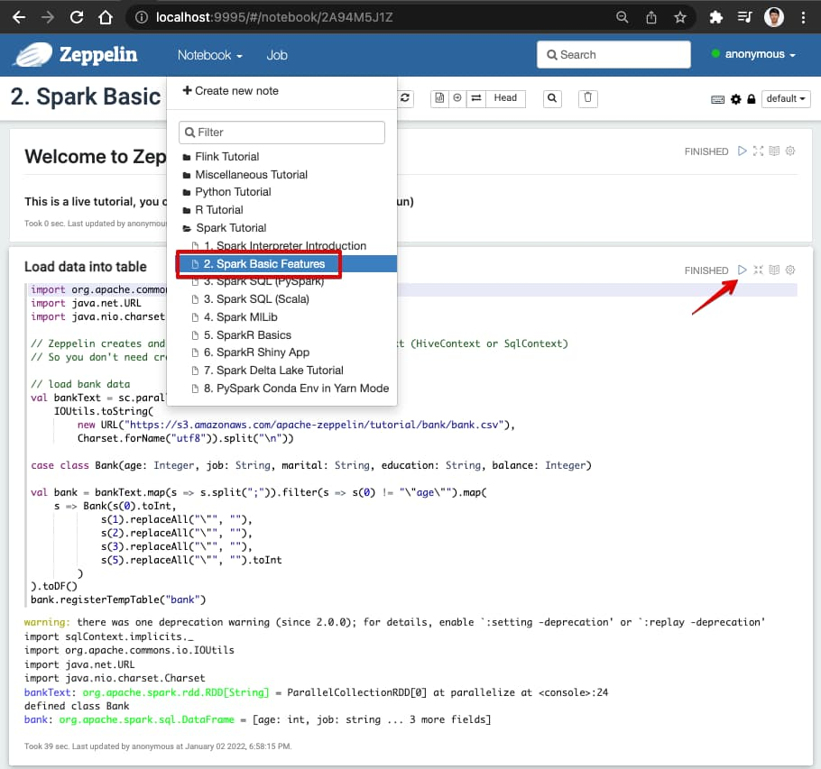

# Quick usage for zeppelin-dev docker image
- Docker build and run
``` bash
git clone https://github.com/hibuz/ubuntu-docker
cd ubuntu-docker/hadoop/zeppelin

docker build -t hibuz/zeppelin-dev .
```

### Run and Attach to running container
``` bash
docker run --rm -it -p 9995:9995 -p 18080:18080 --name zeppelin-tmp hibuz/zeppelin-dev
```

# Visit spark dashboards

- Spark History Server : http://localhost:18080
- Zeppelin Tutorials: http://localhost:9995

